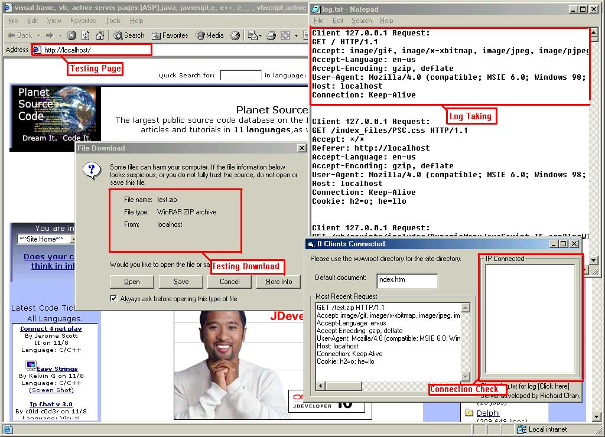

## A Simple Web Server

### Description

The server uses multiple winsock objects to provide multiple connections and it also uses multiple packet-sending to send large files via http safely.

Please vote if you find this code useful.
 
### More Info
 

             |
---                |---
**Submitted On**   |2003-11-09 13:31:36
**By**             |[Richard Chan](https://github.com/Planet-Source-Code/PSCIndex/blob/master/ByAuthor/richard-chan.md)
**Level**          |Intermediate
**User Rating**    |4.7 (42 globes from 9 users)
**Compatibility**  |VB 6\.0
**Category**       |[Internet/ HTML](https://github.com/Planet-Source-Code/PSCIndex/blob/master/ByCategory/internet-html__1-34.md)
**World**          |[Visual Basic](https://github.com/Planet-Source-Code/PSCIndex/blob/master/ByWorld/visual-basic.md)
**Archive File**   |[A\_Simple\_W1669931192003\.zip](https://github.com/Planet-Source-Code/richard-chan-a-simple-web-server__1-49779/archive/master.zip)

